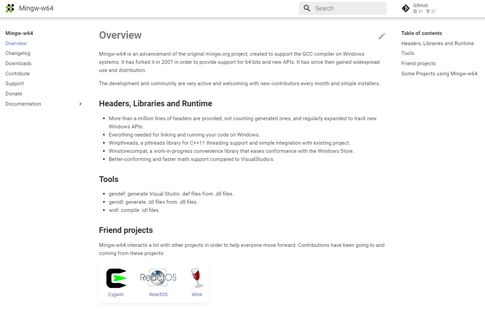
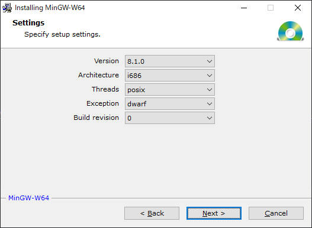
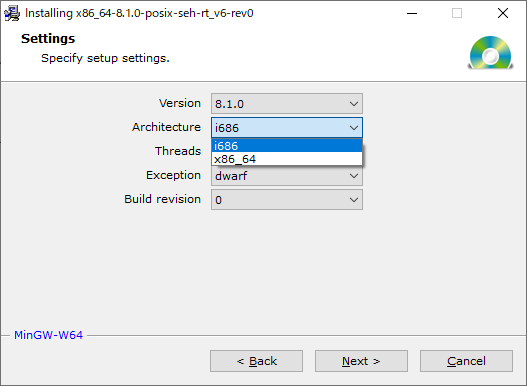
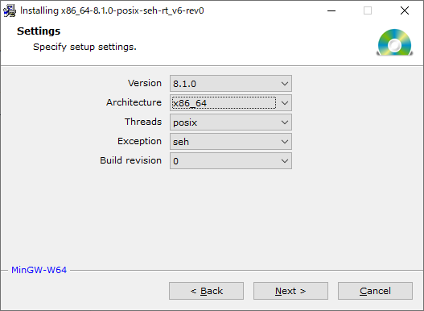
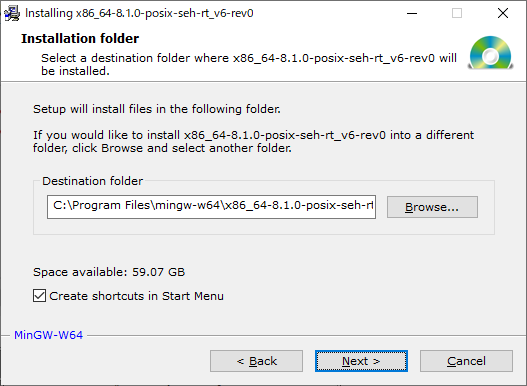
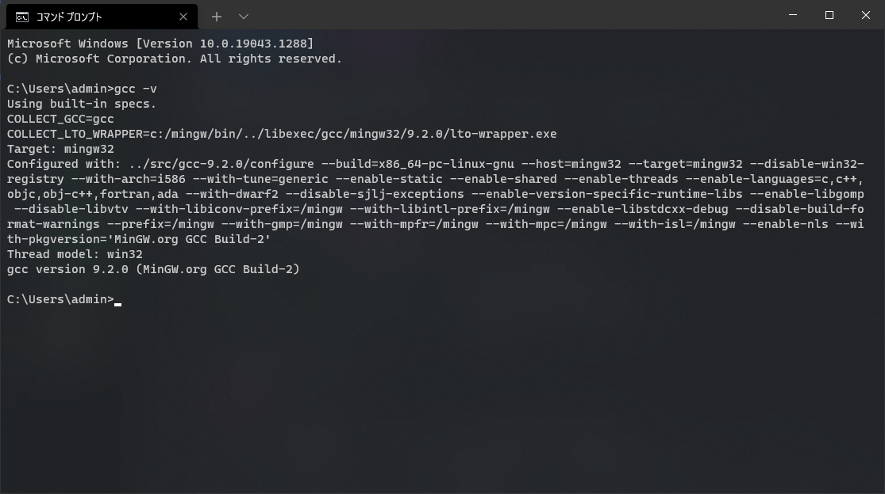

# Mingw-w64

ここでは、C言語コンパイラとして Mingw-w64 を利用します。

GCCと呼ばれるものです。

既にインストールされている場合は、この節は飛ばしてください。

## コンパイラとは？

「そもそも[コンパイラ](https://www.sophia-it.com/content/%E3%82%B3%E3%83%B3%E3%83%91%E3%82%A4%E3%83%A9)って何？」

という方もいると思いますので、説明します。

同じ人間でも話す言語が異なるように、人間とコンピュータでは使用している言葉が異なります。

情報の世界では人間が理解しやすい言語を[高級言語](https://www.sophia-it.com/content/%E9%AB%98%E7%B4%9A%E8%A8%80%E8%AA%9E)(高水準言語)といい、逆にコンピュータが理解しやすい言語を[低級言語](https://www.sophia-it.com/content/%E4%BD%8E%E6%B0%B4%E6%BA%96%E8%A8%80%E8%AA%9E)(低水準言語)と言います。

察しの良い方なら気づいたと思いますが、コンパイラとはこれらの言語をコンピュータが直接実行できる[機械語](https://www.sophia-it.com/content/%E6%A9%9F%E6%A2%B0%E8%AA%9E)(命令語)に翻訳するためのソフトウェアです。

簡単に言うと日本語から他言語に翻訳してくれる人のようなものです。

## Mingw-w64のインストール

MingwはC言語コンパイラの一種です。

C言語コンパイラのド定番なので調べればいくらでも情報が出るのでMingw-w64自体の説明は省きます。

### 確認事項

以下の方法から今使用しているWindowsが64bitか32bitかを確認してください

- [Windows10 32bitと64bitの違いと確認方法](http://www.e-soft.net/post-1693.html)

### Mingw-w64 のダウンロード

以下のリンクにアクセスしてください。

- [Mingw-w64](https://www.mingw-w64.org/)

左のリストにある ``Downloads`` から ``MingW-W64-builds`` を選択してダウンロードしてください。

:::warning
それっぽいWin-Buildsがありますが、これではないので間違えないようにしてください
:::

ちなみに、この[リンク](http://sourceforge.net/projects/mingw-w64/files/Toolchains%20targetting%20Win32/Personal%20Builds/mingw-builds/installer/mingw-w64-install.exe/download)を利用すれば直接ダウンロードできます。(2021/12/25現在)

### Mingw-w64 のインストール

ダウンロードできると ``mingw-w64-install.exe`` という実行ファイルがあるはずなので、それを実行してください。

実行して 次へ を一度押すと、以下のような画面になります。

この時、64bitのWindowsを利用している場合は必ず``Architecture``が``x86_64``になるようにしてください。

:::tip
32bitのWindowsであれば、そのままで問題ありません。 
また、誤って32bitを選択してしまっても、パフォーマンスに影響が出るのみなので今は問題ありません。 
:::

次にインストール先を指定します。

特に問題がなければ変更の必要はありません。

また、``Create shortcuts in Start Menu`` の項目のチェックは自由です。

Next を押すとインストールが始まります。インストールには時間が掛かります。

``Click Next to continue the instllation.``と表示されたらNextをもう一度押します。

インストールが完了したら、Finishを押してウィンドウを閉じます。

そして **必ず再起動してください。**

### 動作確認

コマンドプロンプトを起動し、``gcc -v``と入力してコマンドを実行してください。

以下のような文字列が表示され、インストールした Mingw-w64のバージョンが正しく表示されればインストールは成功です。

出来た場合は、次のエディタのインストールに進んでください。
